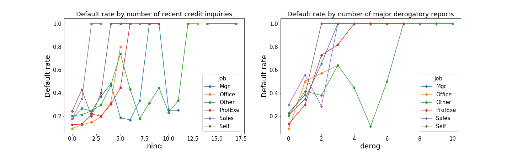
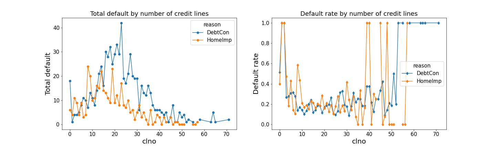

# Home Equity Loan

Home Equity Loan (HMEQ) reports characteristics and delinquency information for 5,960 home equity loans. A home equity loan is a loan where the obligor uses the equity of his/her home as the underlying collateral.

In this project, we predict the probability of default on the loan. The dataset contains two classes - The majority (negative) class comprises 80% of the observations and represents the applicants that paid their loan on time and 20% of the dataset is the minority (positive) class, which represents the applicants who defaulted on thier loan.

The dataset also contains few missing values in some variables, which were imputed before modeling.  We built four supervised classification models: Logistic regression, Support vector machine, Random forest, and XGBoost. The area under the ROC curve (AUC) was used as the performance metric for all the models.

## Data Set Information :  [Credit Risk Analytics](http://www.creditriskanalytics.net/citation-formats.html)

## Attributes Information

1. BAD: 1 = applicant defaulted on loan or seriously delinquent; 0 = applicant paid loan
2. LOAN: Amount of the loan request
3. MORTDUE: Amount due on existing mortgage
4. VALUE: Value of current property
5. REASON: DebtCon = debt consolidation; HomeImp = home improvement
6. JOB: Occupational categories
7. YOJ: Years at present job
8. DEROG: Number of major derogatory reports
9. DELINQ: Number of delinquent credit lines
10. CLAGE: Age of oldest credit line in months
11. NINQ: Number of recent credit inquiries
12. CLNO: Number of credit lines
13. DEBTINC: Debt-to-income ratio

## Exploratory Data Analysis

### 1. Default rate by number of recent credit inquiries & major derogatory reports

### 2. Default rate by number of credit lines

## Feature Importance from Random Forest

Below is the feature importances of the variables from Random Forest classifier

## Model Results

The results shown below are based on optimized AUC-ROC. We can see that XGBoost and SVM are  the best models based on AUC-ROC.

